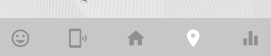
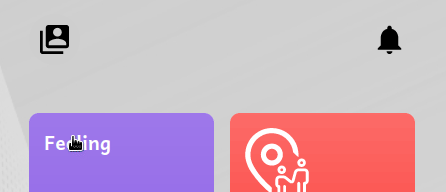
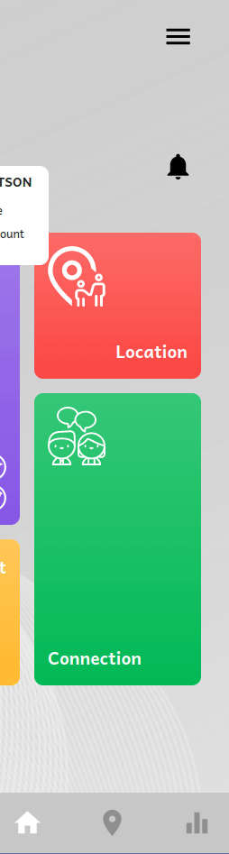

A Gadget for manage your child

**Used Technology:** React js, Mui, Tailwind css, Nodejs, Framer motion

**Project Link:** [app-safestep](https://app.safestepinnovation.com)

**Project Website:** [app-safestep Website](https://app.safestepinnovation.com)

## Screenshots

**Description:** Home page

**Description:** Felling page

**Description:** Connection page

**Description:** Location page

**Description:** User can select area from map

**Description:** Insight page

**Description:** Menu bar

**Description:** Profile page

**Description:** Settings page

**Description:** Contact us page

**Description:** About us page

**Description:** Auth base page

**Description:** Login page

**Description:** Connection number edit page

**Description:** Register page

**Description:** Add child page

**Description:** Selectable buttons

**Description:** Navigation

**Description:** Popover

**Description:** Menu bar animation

